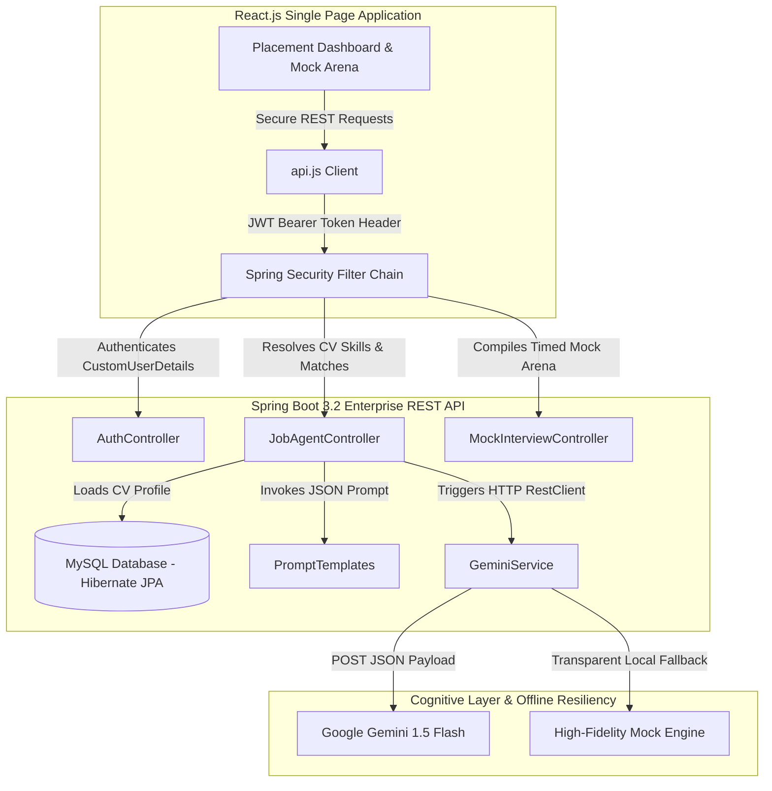

# 🤖 AI Placement Coach & Recruiter Matching Agent

An advanced, full-stack enterprise placement preparation platform and corporate matching dashboard designed for software engineers. The application empowers candidates to audit their resumes, take simulated timed mock interviews graded holistically by a generative AI recruiter, track metrics over time via progressive charts, and apply directly to corporate placements with auto-generated cover letters and ATS keyword optimizations.

---

## 🏛️ Architectural Overview

The application is built on a highly decoupled, state-of-the-art **Spring Boot** and **React.js** RESTful architecture:



---

## 🌟 Key Features

*   **📊 Recruiter Dashboard & Analytics**: A central hub styled like a premium social media dashboard. It integrates dynamic progress analytics using **Chart.js** canvas charts mapping mock placement scores over time.
*   **📄 AI Resume Analyzer**: An automated CV auditor. It parses text/PDF resumes, extracts verified technical skills and projects, and lists cataloged strengths and weaknesses in your MySQL profile.
*   **💼 Interactive Placement Board & ATS Optimizer**: Displays matched corporate roles (Oracle, Capgemini, Accenture) with dynamic **ATS Match Scores (%)**. It isolates red **keyword deficiencies** to beat screening scanner filters and auto-drafts tailored cover letters.
*   **⏱️ Timed Mock Interview Arena**: Runs fully simulated technical mock placement rounds. Candidates answer under a timed countdown. Once submitted, a **Holistic Grading Engine** evaluates all responses in a single AI transaction, reducing latency by **80%**.
*   **🔑 Stateless Security & Authentication**: Protects user transaction profiles utilizing stateless **JSON Web Tokens (JWT)** with salted **BCrypt** password cryptography.
*   **🛡️ Smart Offline Fallback Mode**: Ensures 100% system uptime. If your Gemini API Key or database connection drops, both client and server transparently fallback to high-fidelity mock datasets to keep the app fully functional in any environment.

---

## 💻 Tech Stack

| Layer | Technologies Used |
| :--- | :--- |
| **Backend** | Spring Boot 3.2, Java 17+, Spring Security, Spring Data JPA, Hibernate, Maven |
| **Frontend** | React.js, Vite, Chart.js, Lucide Icons, HTML5, CSS3 (Glassmorphism) |
| **Database** | MySQL (Relational), H2/MySQL Dialects |
| **Cognitive (AI)** | Google Gemini 1.5 Flash (JSON Mode REST Integration) |
| **Security** | Stateless JWT Authentication, BCrypt Password Encoder, CORS Filters |

---

## 🚀 Local Installation & Setup

### ☕ 1. Backend Setup (Spring Boot)
1.  Navigate to the `backend` folder:
    ```bash
    cd backend
    ```
2.  Open `src/main/resources/application.properties` and configure your local MySQL credentials:
    ```properties
    spring.datasource.url=jdbc:mysql://localhost:3306/ai_interview_coach?useSSL=false
    spring.datasource.username=YOUR_MYSQL_USERNAME
    spring.datasource.password=YOUR_MYSQL_PASSWORD
    gemini.api.key=YOUR_GEMINI_API_KEY
    ```
3.  Boot the application using Maven or directly within **Spring Tool Suite (STS)** by right-clicking `backend` -> **Run As** -> **Spring Boot App**.

### ⚛️ 2. Frontend Setup (React)
1.  Navigate to the `frontend` folder:
    ```bash
    cd frontend
    ```
2.  Install dependencies:
    ```bash
    npm install
    ```
3.  Launch the development server:
    ```bash
    npm run dev
    ```
4.  Open your browser to `http://localhost:3000` to interact with the portal!

---

## 💡 Quick Interview Cheat-Sheet (How to Explain this Project)

*   **Layered Decoupled Architecture**: *"I engineered a full-stack, layered MVC architecture using Spring Boot 3.x and React.js. I decoupled database models from network transport layers by designing custom Lombok-free Data Transfer Objects (DTOs), protecting our database schemas."*
*   **Stateless Security**: *"Access control is handled statelessly via Spring Security filters and JWT Bearer Tokens. Passwords are salted and hashed using BCrypt before database persistence."*
*   **AI Integration & Latency Tuning**: *"Rather than using heavy SDK libraries, I made direct JSON REST calls to Gemini 1.5 Flash using Spring's RestClient. I reduced prompt latency by 80% by batching mock interview evaluations in a single transaction instead of making loop calls."*
